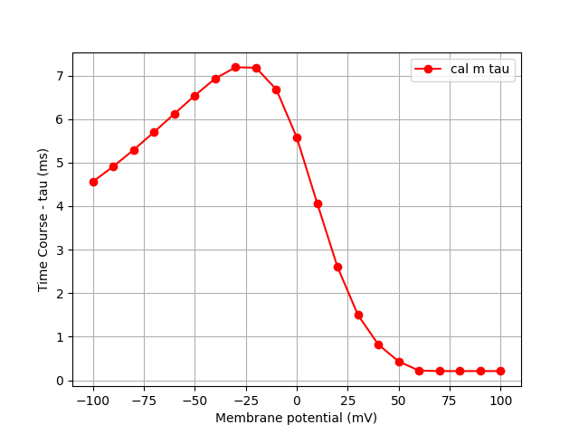
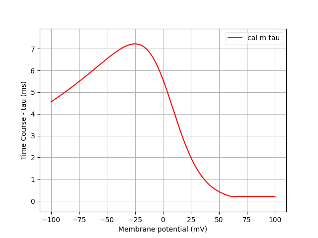
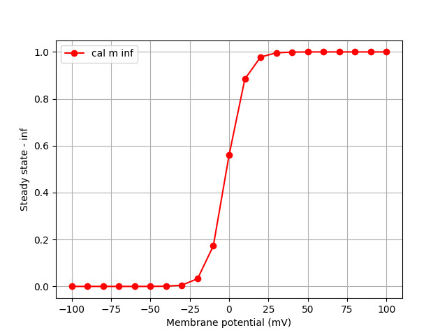
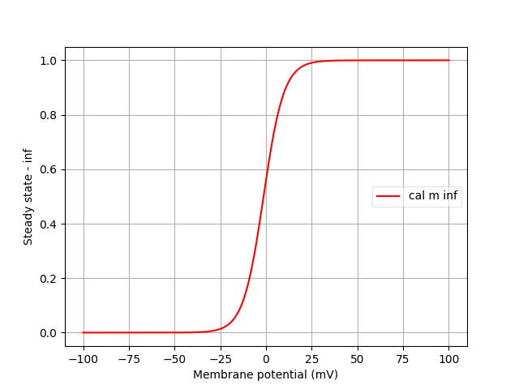
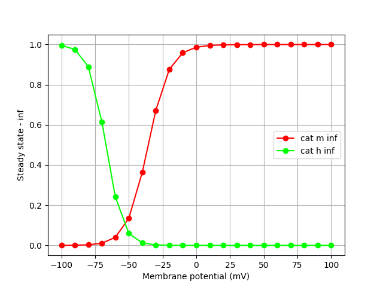
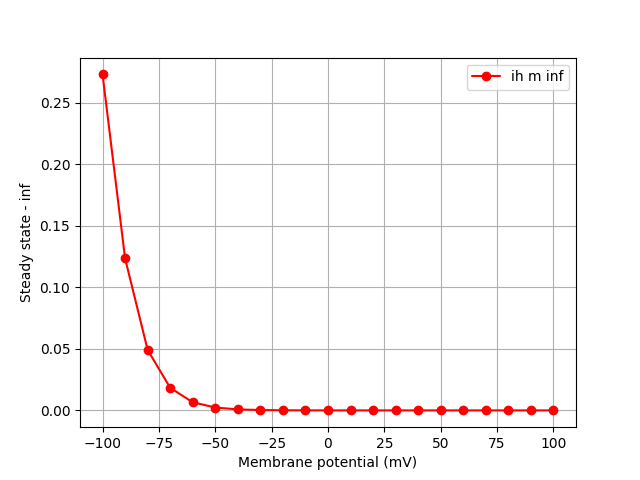
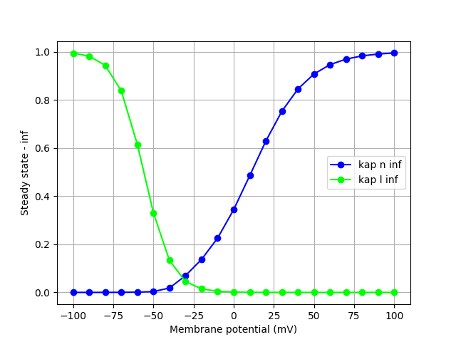
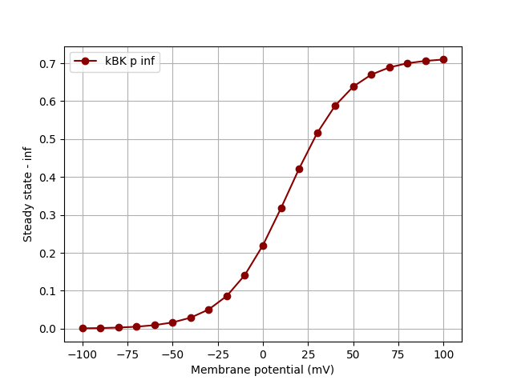
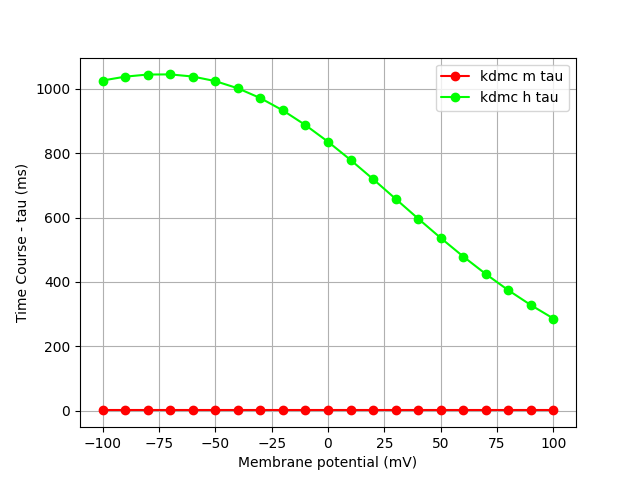
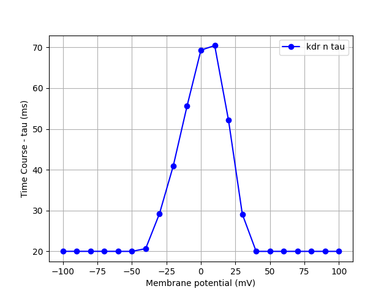

|Channels  |Description |Link_nml |Tau_mod |Tau_nml |Inf_mod |Inf_nml |
|----------|------------|---------|--------|--------|--------|--------|
|**cal**   |L-type calcium channel: https://senselab.med.yale.edu/ModelDB/ShowModel.asp?model=148094&file=\kv72-R213QW-mutations\cal2.mod|channels/cal_mig.channel.nml        |||||
|**can**   |n-type calcium: http://senselab.med.yale.edu/modeldb/ShowModel.asp?model=126814|||
|**cat**|T-type calcium channel: http://senselab.med.yale.edu/modeldb/ShowModel.asp?model=126814|||
|**ih**|Ih-current: modified from http://senselab.med.yale.edu/ModelDB/showmodel.cshtml?model=64195&file=%5cStochastic%5cStochastic_Na%5cih.mod|||
|**kap**|K-A channel from Klee Ficker and Heinemann|||
|**kBK**|large-conductance calcium-activated potassium channel: https://senselab.med.yale.edu/ModelDB/ShowModel.cshtml?model=168148&file=/stadler2014_layerV/kBK.mod|||
|**kdmc**|K-D current with activation, for motor cortex pyramidal neurons, per Miller et al. (2008)|||
|**kdr**|K-DR channel from Klee Ficker and Heinemann: modified to account for Dax et al.|||
|**nax**|Na current for axon. No slow inact: M.Migliore Jul. 1997|||