# Ion Channel Documentation

<b>Click to expand complete ion channel comparison table</b>

| Channel | Description | MOD Source | NeuroML Source | Tau (MOD) | Tau (NeuroML) | Inf (MOD) | Inf (NeuroML) |
|---------|-------------|------------|----------------|---------|-------------|--------------------|-----------------------|
| **cal** | L-type calcium channel | [ModelDB](https://senselab.med.yale.edu/ModelDB/ShowModel.asp?model=148094) | [NeuroML](https://github.com/OpenSourceBrain/Macaque_auditory_thalamocortical_model_data/blob/feat-neuroml-gsoc/NeuroML2/channels/cal_mig.channel.nml) |  |  |  |  |
| **can** | N-type calcium channel | [ModelDB](http://senselab.med.yale.edu/modeldb/ShowModel.asp?model=126814) | [NeuroML](https://github.com/OpenSourceBrain/Macaque_auditory_thalamocortical_model_data/blob/feat-neuroml-gsoc/NeuroML2/channels/can_mig.channel.nml) |  | 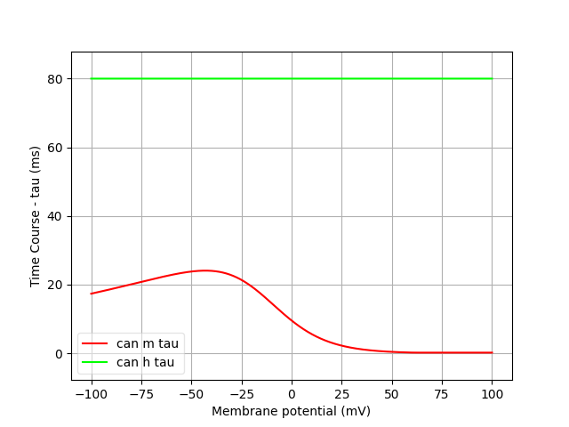 | 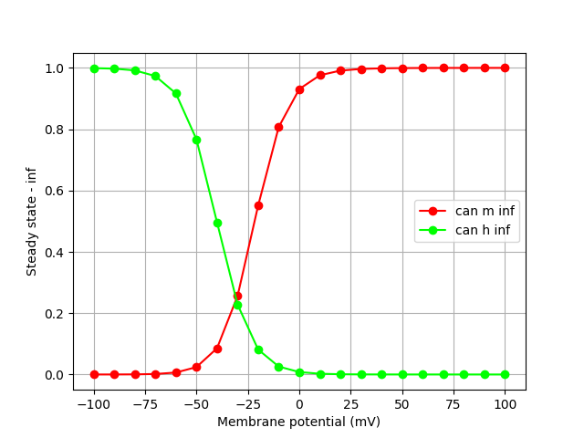 | 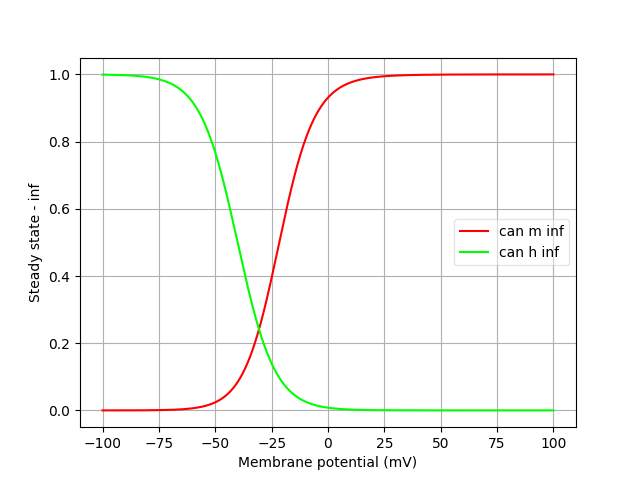 |
| **cat** | T-type calcium channel | [ModelDB](http://senselab.med.yale.edu/modeldb/ShowModel.asp?model=126814) | [NeuroML](https://github.com/OpenSourceBrain/Macaque_auditory_thalamocortical_model_data/blob/feat-neuroml-gsoc/NeuroML2/channels/cat_mig.channel.nml) | 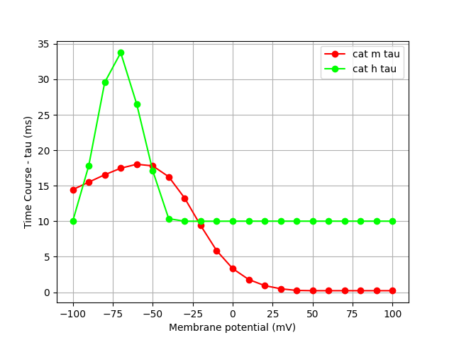 | 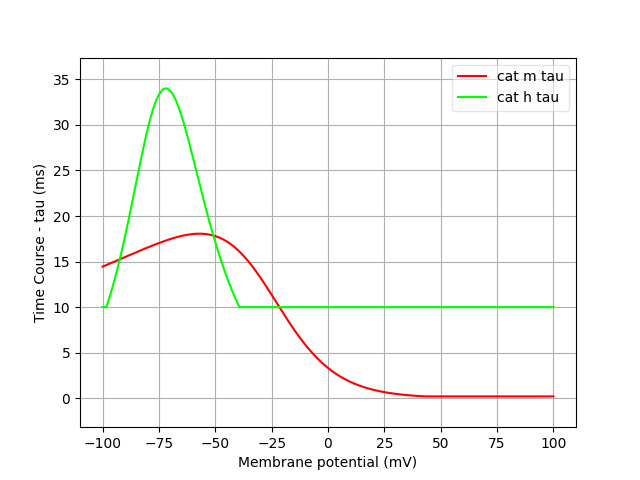 |  | 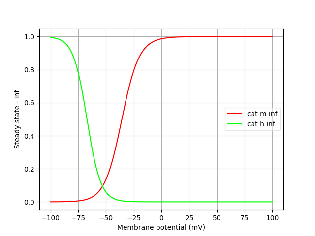 |
| **ih** | Ih-current (modified) | [ModelDB](http://senselab.med.yale.edu/ModelDB/showmodel.cshtml?model=64195) | [NeuroML](https://github.com/OpenSourceBrain/Macaque_auditory_thalamocortical_model_data/blob/feat-neuroml-gsoc/NeuroML2/channels/h_kole.channel.nml) | 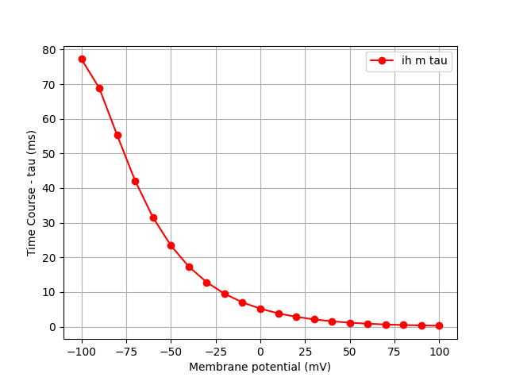 | 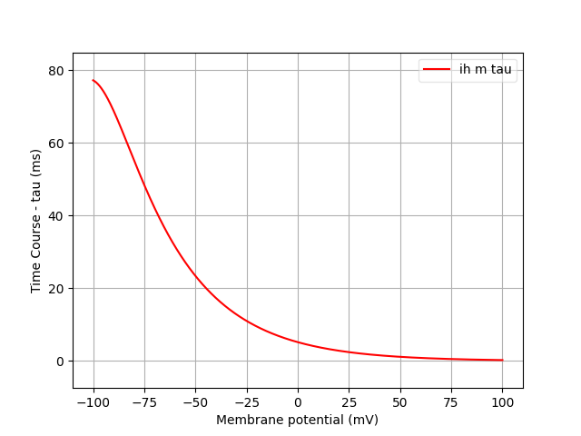 |  | 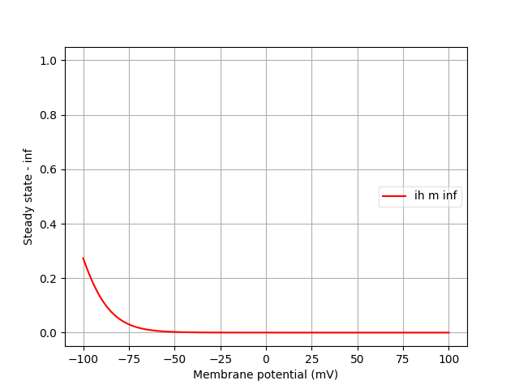 |
| **kap** | K-A channel (Klee Ficker Heinemann) | - | [NeuroML](https://github.com/OpenSourceBrain/Macaque_auditory_thalamocortical_model_data/blob/feat-neuroml-gsoc/NeuroML2/channels/kap_BS.channel.nml) | 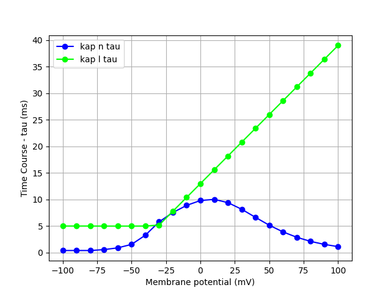 | 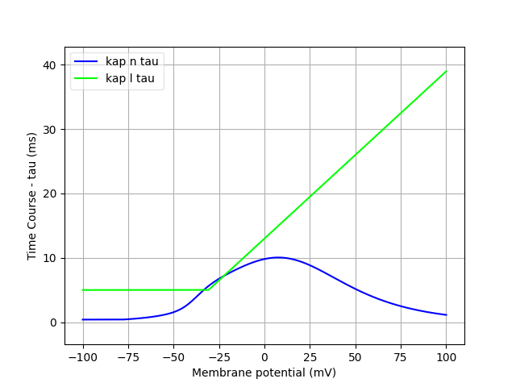 |  | 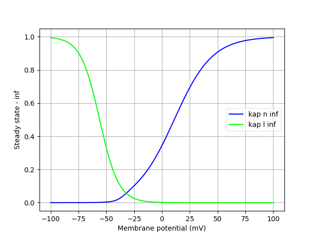 |
| **kBK** | Large-conductance Ca²⁺-activated K⁺ channel | [ModelDB](https://senselab.med.yale.edu/ModelDB/ShowModel.cshtml?model=168148) | [NeuroML](https://github.com/OpenSourceBrain/Macaque_auditory_thalamocortical_model_data/blob/feat-neuroml-gsoc/NeuroML2/channels/kBK.channel.nml) | 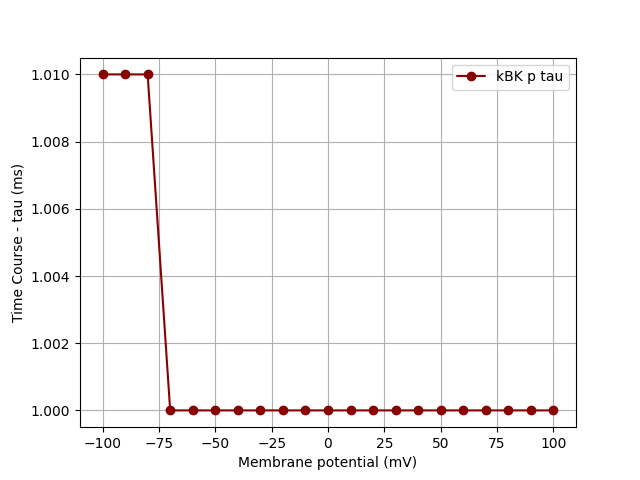 | 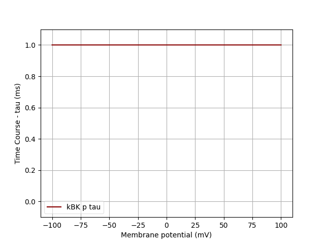 |  | 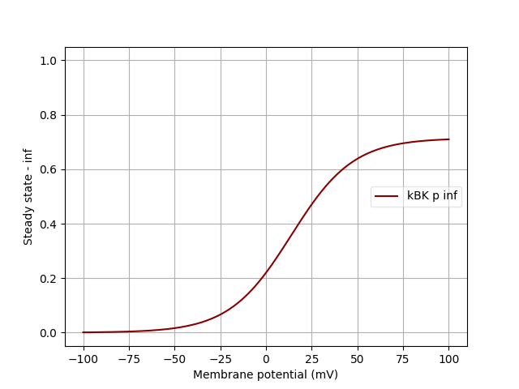 |
| **kdmc** | K-D current for motor cortex pyramidal neurons (Miller et al. 2008) | - | [NeuroML](https://github.com/OpenSourceBrain/Macaque_auditory_thalamocortical_model_data/blob/feat-neuroml-gsoc/NeuroML2/channels/kdmc_BS.channel.nml) |  | 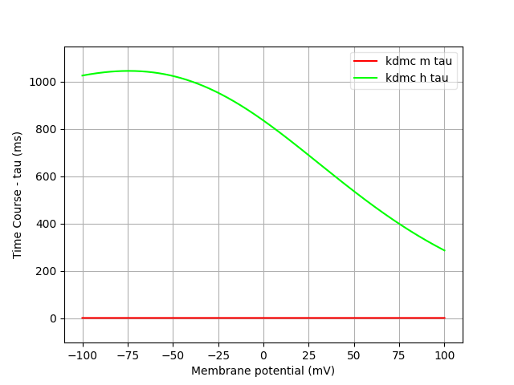 | 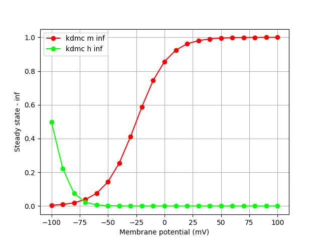 | 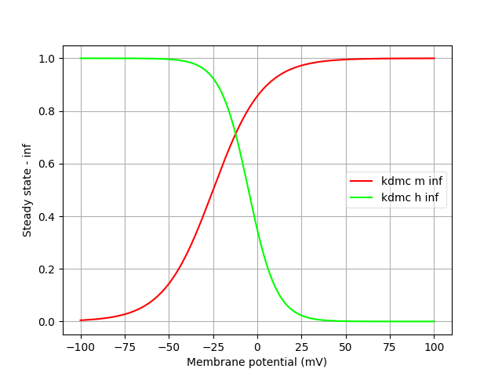 |
| **kdr** | K-DR channel (modified for Dax et al.) | - | [NeuroML](https://github.com/OpenSourceBrain/Macaque_auditory_thalamocortical_model_data/blob/feat-neuroml-gsoc/NeuroML2/channels/kdr_BS.channel.nml) |  | 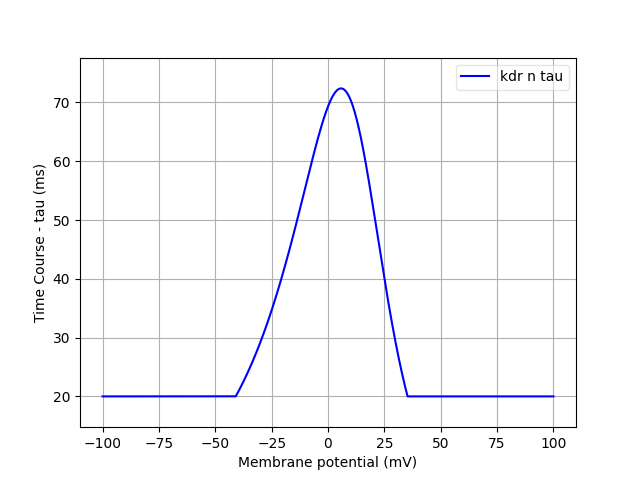 | 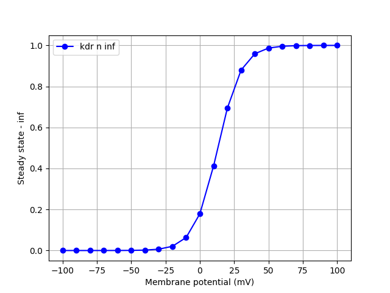 | 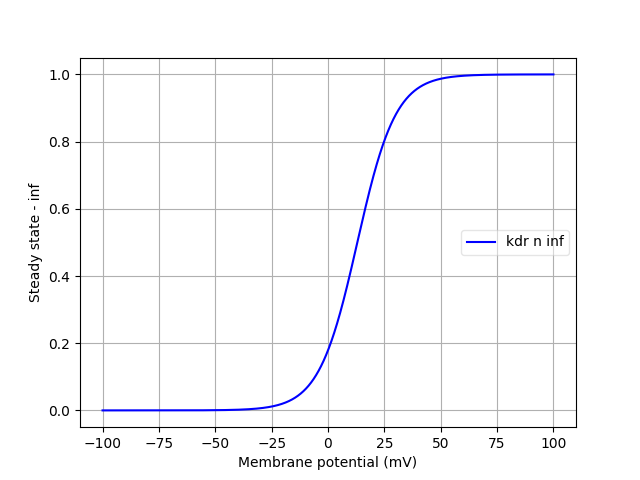 |
| **nax** | Axonal Na⁺ current (Migliore 1997) | - | [NeuroML](https://github.com/OpenSourceBrain/Macaque_auditory_thalamocortical_model_data/blob/feat-neuroml-gsoc/NeuroML2/channels/nax_BS.channel.nml) | 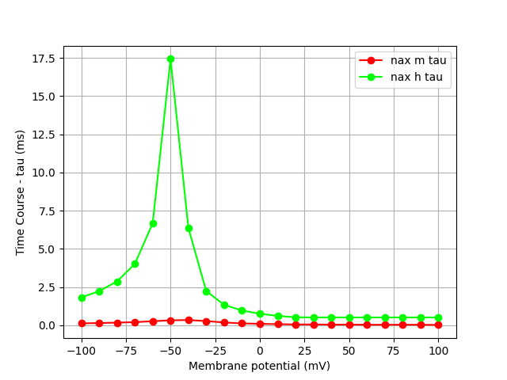 | 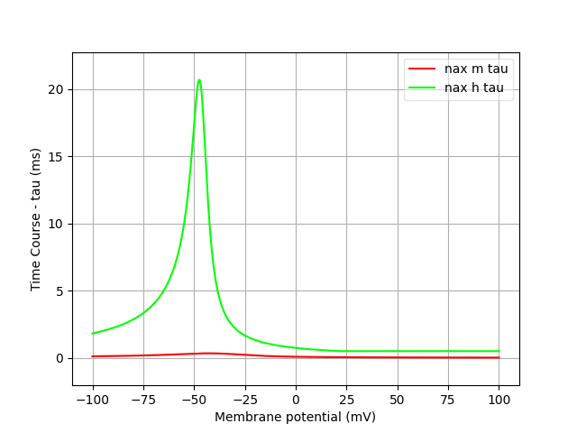 | 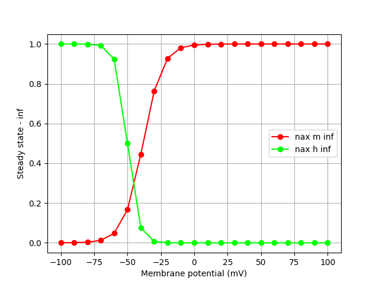 | 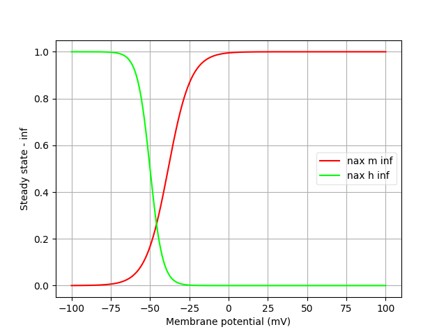 |

## Full-size Graphs

### cal
**Tau**  
   
**Inf**  
 

### can
**Tau**  
   
**Inf**  
 

### cat
**Tau**  
   
**Inf**  
 

### ih
**Tau**  
   
**Inf**  
 

### kap
**Tau**  
   
**Inf**  
 

### kBK
**Tau**  
   
**Inf**  
 

### kdmc
**Tau**  
   
**Inf**  
 

### kdr
**Tau**  
   
**Inf**  
 

### nax
**Tau**  
   
**Inf**  
 
