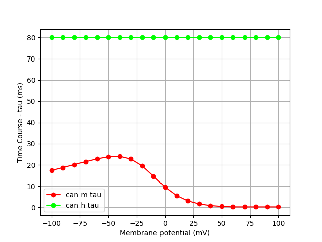

|Channels  |Description |Tau |Inf |
|----------|------------|----|----|
|**cal**   |L-type calcium channel with [Ca]i inactivation this version from https://senselab.med.yale.edu/ModelDB/ShowModel.asp?model=148094&file=\kv72-R213QW-mutations\cal2.mod        |                         |                        |
|**can**   |n-type calcium http://senselab.med.yale.edu/modeldb/ShowModel.asp?model=126814 by Michele Migliore         |               |                |
