# Comparison: NetPyNE vs NeuroML

| Channel | mod source | NeuroML source |  NetPyNE plot | NeuroML plot | Combined plot|
|---------|------------|----------------|---------------|--------------|--------------|
| all | - | - | 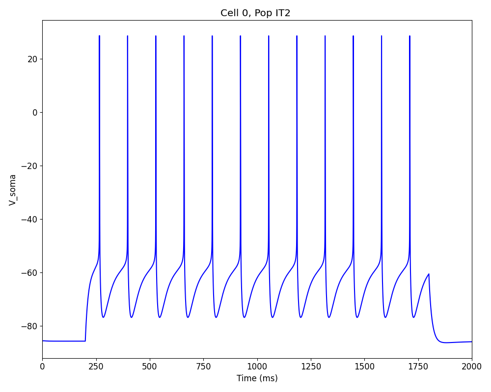 | 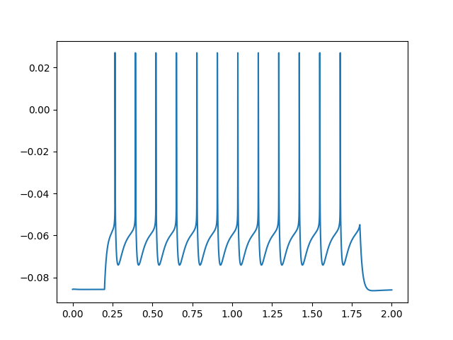 | 
| cal | [cal.mod](../mod/cal.mod) | [cal.channel.nml](../cal.channel.nml) |  | 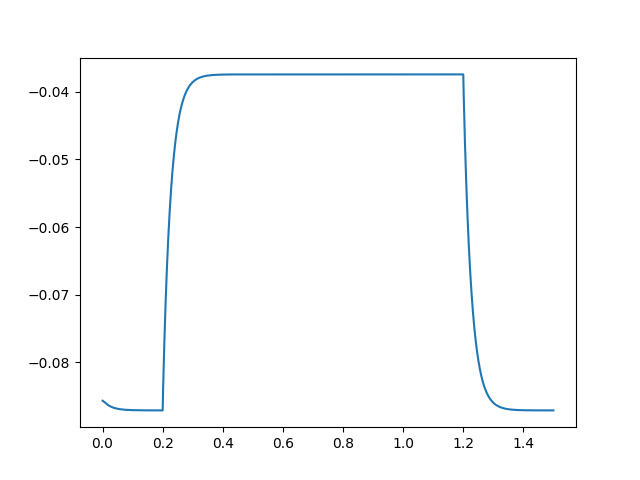 | 
| can | [can.mod](../mod/can.mod) | [can.channel.nml](../can.channel.nml) |  |  | 
| cat | [cat.mod](../mod/cat.mod) | [cat.channel.nml](../cat.channel.nml) | 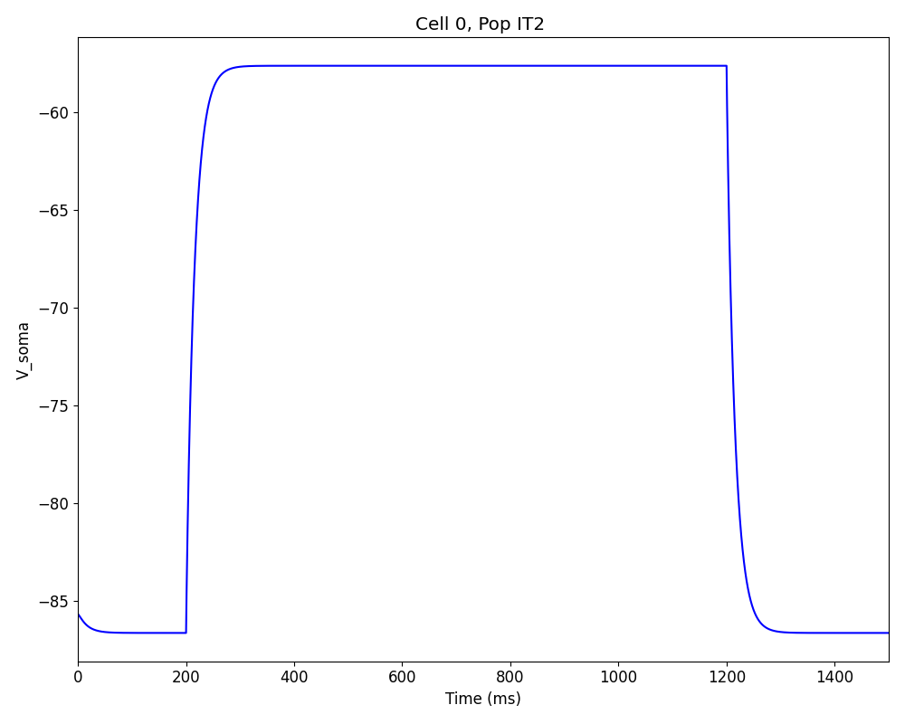 | 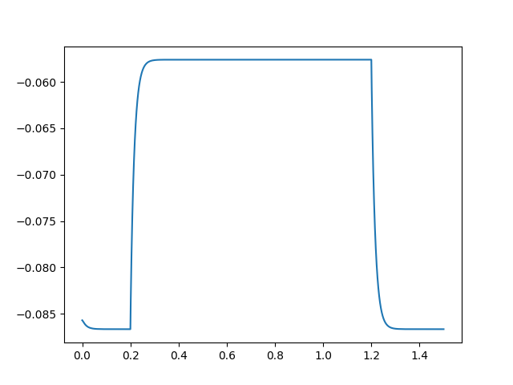 | 
| ih | [ih.mod](../mod/ih.mod) | [ih.channel.nml](../ih.channel.nml) | 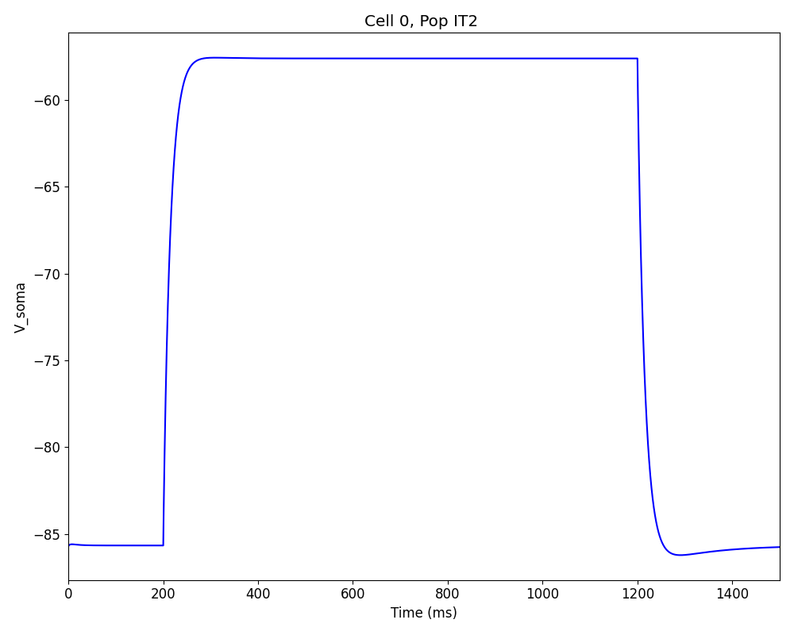 | 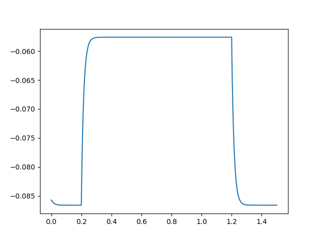 | 
| kBK | [kBK.mod](../mod/kBK.mod) | [kBK.channel.nml](../kBK.channel.nml) |  |  | 
| kap | [kap.mod](../mod/kap.mod) | [kap.channel.nml](../kap.channel.nml) |  | 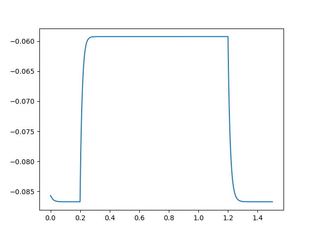 | 
| kdr | [kdr.mod](../mod/kdr.mod) | [kdr.channel.nml](../kdr.channel.nml) | 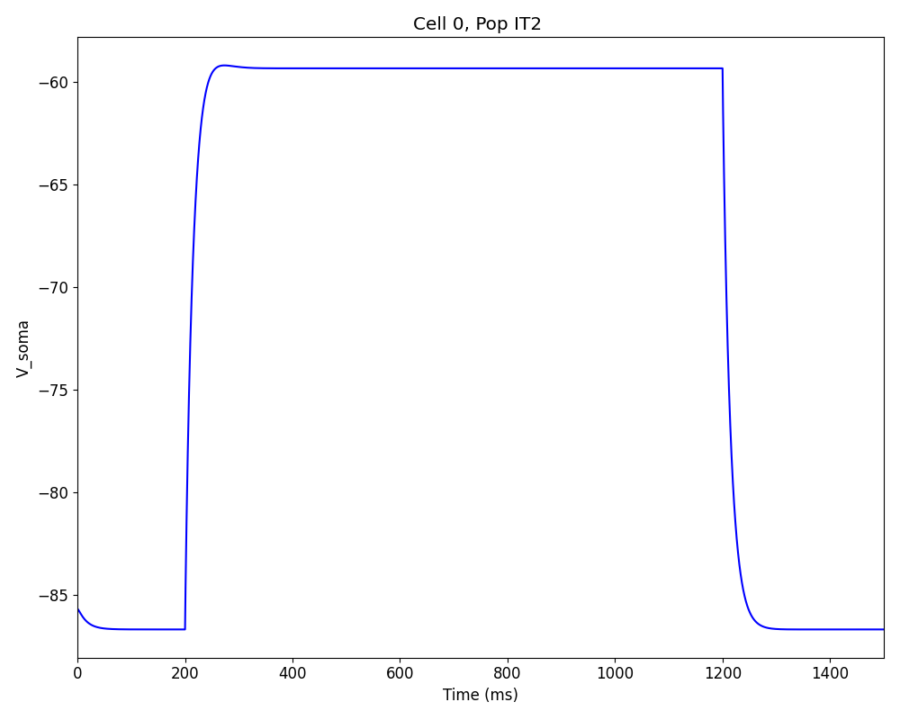 | 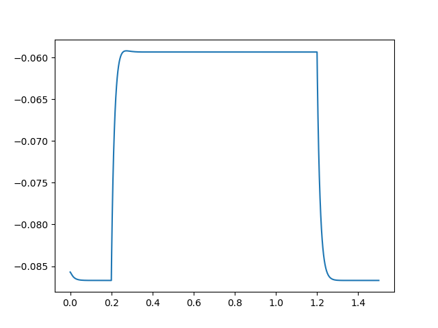 | 
| nax | [nax.mod](../mod/nax.mod) | [nax.channel.nml](../nax.channel.nml) | 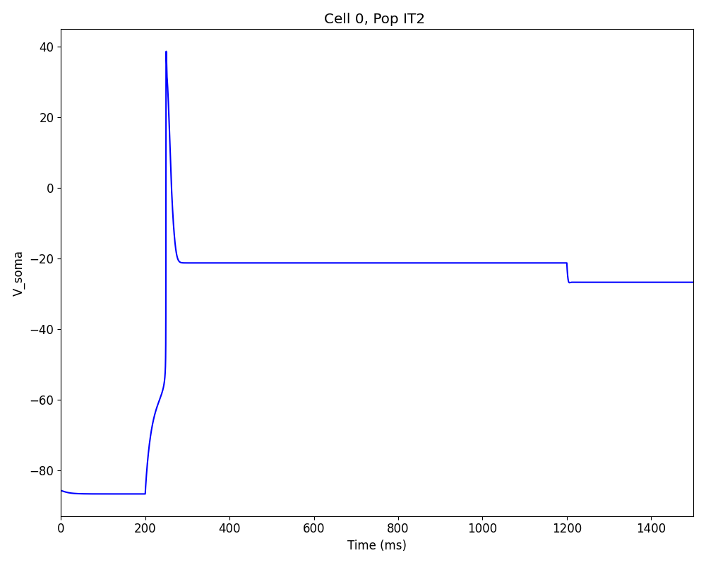 | 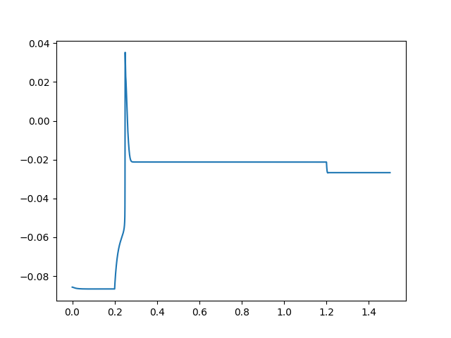 | 
| pas | [pas.mod](../mod/pas.mod) | [pas.channel.nml](../pas.channel.nml) |  |  | 

